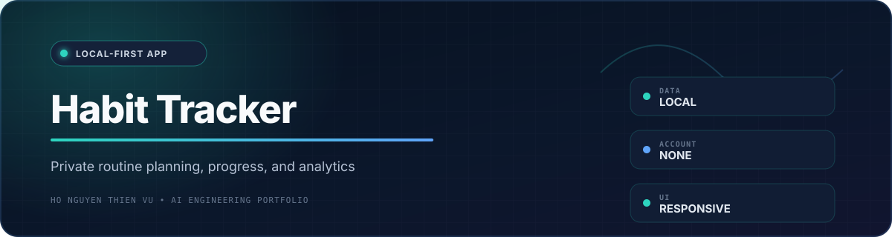
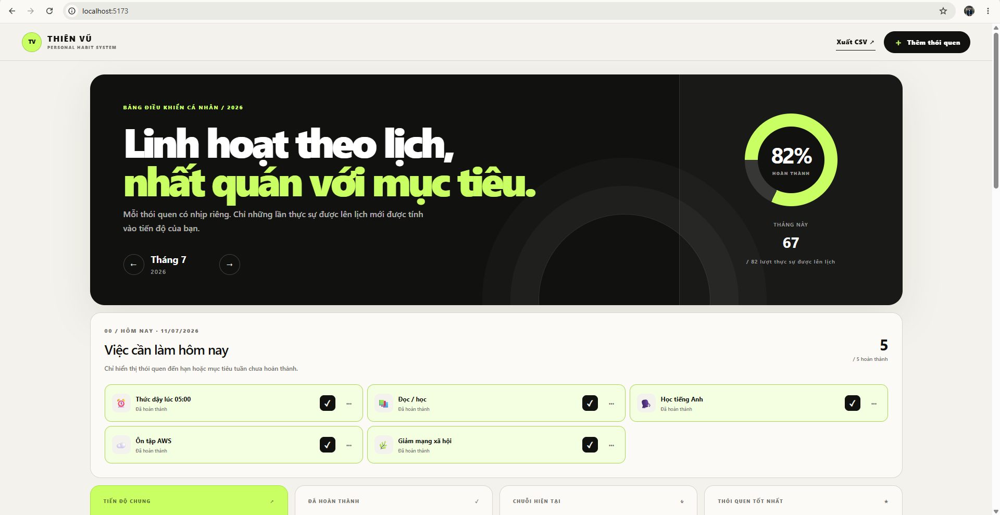
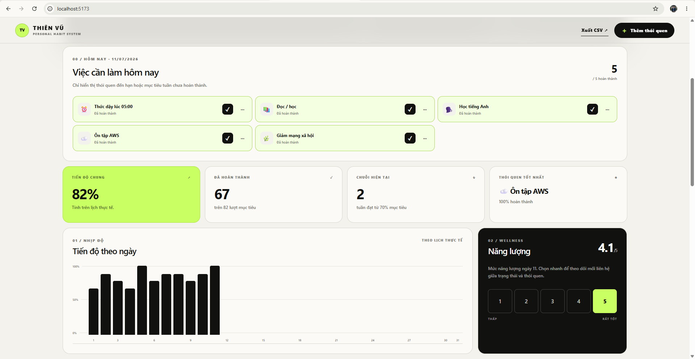
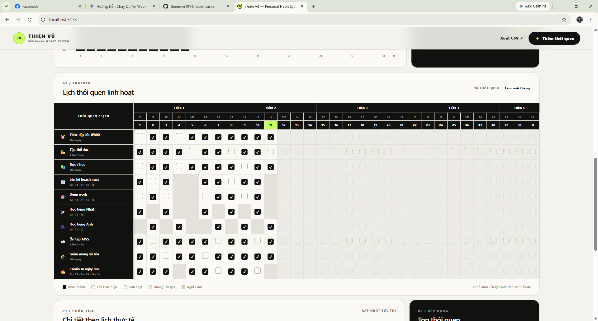
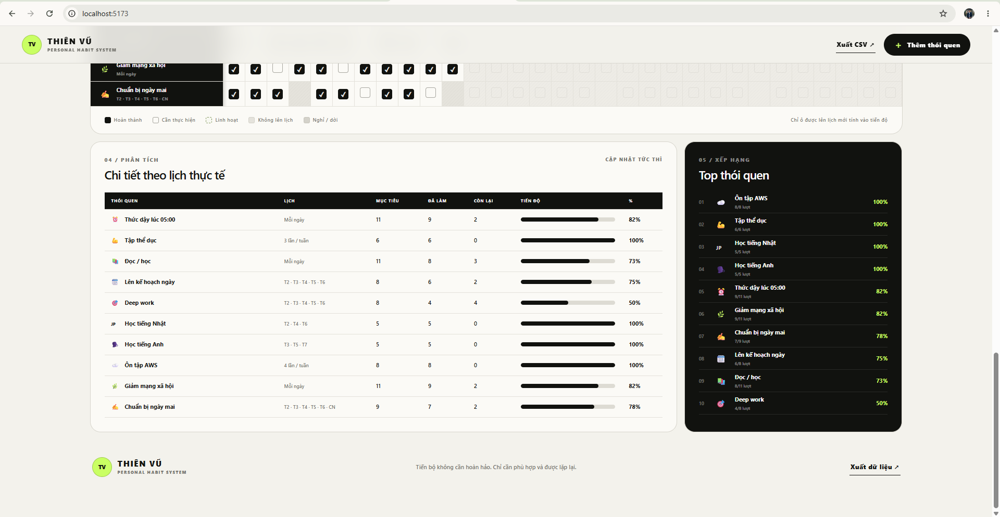
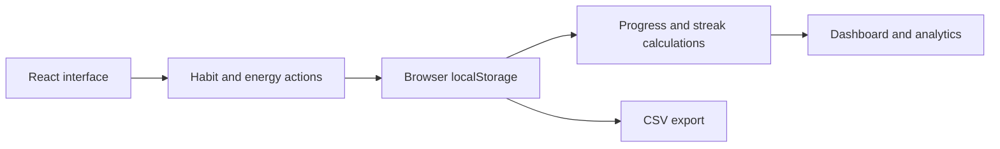

<div align="center">
  
  <br /><br />

  
  
  
  
</div>

## Overview

**Habit Tracker** is a local-first web application for planning, logging, and reviewing routines without an account or external database. Habit data stays in the browser through `localStorage`, keeping the experience private, fast, and easy to run.



## At a Glance

| Privacy | Capacity | Scheduling | Portability |
|---|---:|---|---|
| **Browser-local data** | **Up to 20 habits/month** | **Daily, weekdays, frequency, dates** | **CSV export** |

## Product Experience

<table>
  <tr>
    <td width="50%" valign="top">
      <h3>📅 Plan with flexibility</h3>
      <p>Create daily, weekday-based, frequency-based, or date-specific schedules without rewriting past records.</p>
    </td>
    <td width="50%" valign="top">
      <h3>✅ Focus on today</h3>
      <p>See only tasks that are due and weekly goals that still require progress.</p>
    </td>
  </tr>
  <tr>
    <td width="50%" valign="top">
      <h3>📊 Understand consistency</h3>
      <p>Review daily progress, habit-level analytics, rankings, streaks, and energy records.</p>
    </td>
    <td width="50%" valign="top">
      <h3>🔒 Keep data local</h3>
      <p>No account or external database is required. Export monthly records to CSV when needed.</p>
    </td>
  </tr>
</table>

## Screenshots

<table>
  <tr>
    <td width="50%" valign="top">
      
      <p align="center"><strong>Today's Tasks & Energy</strong></p>
    </td>
    <td width="50%" valign="top">
      
      <p align="center"><strong>Monthly Habit Grid</strong></p>
    </td>
  </tr>
  <tr>
    <td colspan="2" valign="top">
      
      <p align="center"><strong>Analytics & Ranking</strong></p>
    </td>
  </tr>
</table>

## Core Features

- Monthly tracking for up to 20 habits
- Daily, selected-weekday, custom-frequency, and specific-date schedules
- Focused Today view for due tasks and incomplete weekly goals
- Rest days and within-week rescheduling without breaking streak logic
- Non-destructive schedule changes that preserve historical records
- Add, edit, delete, and month-navigation flows
- Daily, per-habit, ranking, and streak analytics
- Progress calculations based on scheduled occurrences rather than calendar days
- Daily energy tracking from 1 to 5
- Monthly CSV export
- Responsive desktop and mobile layout
- Automatic persistence with no sign-in

## Local-First Data Flow



## Technology


- **Application:** Next.js, React, and TypeScript
- **Development/build tooling:** Vite and Cloudflare tooling
- **Persistence:** browser `localStorage` by default
- **Optional scaffolding:** Drizzle-related database examples and generated artifacts

## Run Locally

**Prerequisite:** Node.js 22.13 or newer.

```bash
npm install
npm run dev
```

Open the local URL displayed in the terminal, typically `http://localhost:5173`.

On Windows, `run-local.bat` installs dependencies on the first run and starts the development server.

## Production Build

```bash
npm run build
npm run start
```

## Available Scripts

| Command | Purpose |
|---|---|
| `npm run dev` | Start the development server |
| `npm run build` | Create a production build |
| `npm run start` | Run the production build locally |
| `npm run test` | Build the app and run the rendered HTML test |
| `npm run lint` | Run lint checks |
| `npm run db:generate` | Generate Drizzle artifacts through the project setup |

## Privacy and Data Notes

- Habit and energy data stays in the current browser profile unless a different persistence layer is added.
- Clearing browser storage removes local records unless they were exported.
- Data does not automatically synchronize between devices or browsers.
- The app is intended as a personal productivity tool, not a medical or behavioral-health system.
